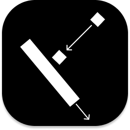

<h1 align="center">  <br> <a>Deep Learning with Pong</a> – <i>DQN vs PPO</i> </h1> <p align="center"> <a href="https://isocpp.org/" target="_blank"></a> <a href="https://cmake.org/" target="_blank"></a> <a href="https://www.pygame.org/news" target="_blank"></a> <a href="https://www.python.org/" target="_blank"></a> <a href="https://pytorch.org/" target="_blank"></a> <a href="https://colab.research.google.com/" target="_blank"></a> </p>


# Overview
This project explores reinforcement learning techniques by training agents to play Pong. We compare Deep Q-Learning (DQN) and Proximal Policy Optimization (PPO) on a custom C++ Pong environment.

**Developed by**: Catherine Reller, Fardeen Bablu, and Tobenna Udeza


## Running the Pong Game (C++)

### Prerequisites

You will need to install SDL2 and SDL_TTF using Homebrew:
```
brew install sdl2
brew install sdl2_ttf
```

### Configure CMAKE, SDL2, & SDL_TTF

After installation, locate the directory containing the `.h` files for SDL2 and SDL_TTF. The default directory may vary, so you may need to look it up. Below are some example paths:

- **CMAKE_PREFIX_PATH**: `/opt/homebrew` (Modify line 6 in `CMakeLists.txt`)
- **Include**: `/opt/homebrew/cellar/sdl2_ttf/2.24.0/include` (Modify line 15)
- **Target Link Libraries**: `/opt/homebrew/cellar/sdl2_ttf/2.24.0/lib/libSDL2_ttf.dylib` (Modify line 35)


### Font Setup (macOS Only)

Ensure the required font is in your Font Book (for in-game score).

```
std::string fontPath = std::string(getenv("HOME")) + "/Library/Fonts/DejaVuSansMono.ttf";
TTF_Font* scoreFont = TTF_OpenFont(fontPath.c_str(), 40);
```
    
### Building and Running
```
cd project_pong_cpp/build
cmake ..
make
./project_pong_cpp
```
**Note**: Avoid using VS Code unless you’ve properly configured your C++ build environment.

### Training Agents with Python

The scripts that run our model are

1. `direct_rl_trainer.py` - DQN-based direct training
2. `ppo_agent.py`         – PPO with feature vector inputs
3. `pong_rl_trainer.py`   - Screenshot-based (currently not implemented)

First ensure you're working in the proper python environment and interpreter. We used Python version 3.12.

### How to Run
Ensure you're in a Python 3.12+ environment. Then run:
```
python [SCRIPT].py train --env custom --episodes [NUM_EPISODES]
```

### Example Run & Graph

```
python ppo_agent.py train --env custom --episodes 2000
```

<p align="center">  </p>

Training logs and plots (e.g., rewards, losses) are automatically generated as a PNG file after completion. This may take a while if you've requested a lot of episodes.

# License 
[MIT License](https://github.com/Tobena04/deep_learning_pong_project/blob/main/LICENSE)

